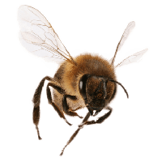

**Bee Image Classification using a CNN to determine presence of Varroa mites**

#### Author: Mahdi Shadkam-Farrokhi: [GitHub](https://github.com/Shaddyjr) | [Medium](https://medium.com/@mahdis.pw) | [LinkedIn](https://www.linkedin.com/in/mahdi-shadkam-farrokhi-m-s-8a410958/) | [mahdis.pw](http://mahdis.pw)

#### This project is featured in a Medium post: [link](https://medium.com/@mahdis.pw/bee-image-classification-using-a-cnn-and-keras-5fd5ed90a37b)

## Problem Statement
Beekeepers must face a myriad of threats to their hives. The _Varroa (pronounced "vr-ow-uh") destructor_, or more commonly the _varroa mite_, is a natural predator to honey bees and is one of the biggest pests plaguing the bee keeping community. The sooner a keeper can begin treating for _varroa_, the less likely a [colony collapse](https://ipm.missouri.edu/MPG/2013/7/Colony-Collapse-Disorder-the-Varroa-Mite-and-Resources-for-Beekeepers/) will occur.  Early detection could mean the difference between a healthy hive and a dead one. 

## Executive Summary
With the dataset from the [Honey Bee Annotated Image Dataset](https://www.kaggle.com/jenny18/honey-bee-annotated-images) found on Kaggle, we will train a Convolutional Neural Network (CNN) to classify bee images as having _varroa mites_ or not (binary classification). As a general metric, we will use accuracy to select our best model.

Our best model showed a __99.64% accuracy__ on the testing dataset. Although this sounds compelling, there are a number of considerations that must be taken into account in order to better understand this score.

First, we must acknoledge the substantially low sample size of this dataset, having less than 4,500 images. Well established norms in image classification suggests having tens of thousands of observations in order to have confidence in the trained model. Surprisingly, the images of _varroa_ classified bees all came from the same location, and likely the same photographer. This inherently factors bias into our model. Given our findings, it is highly likely this played a significant role in how our model classified images - in particular, the unique background color in these images.

Other issues arose from the images themselves. Almost every image has a unique width and height, which forced us to rescale and standardize each image. This invariably lead to loss of data quality. Lastly, after looking at many of these images direclty, it was clear many did not properly depict a bee. For example, some images simply featured a shadow, while others featured only partial bees. Some images weren't even human readable.Taking these factors into perspective, it's difficult to discern if the model would perform well outside of this dataset.

## Source Documentation
- [Honey Bee Annotated Image Dataset (Kaggle)](https://www.kaggle.com/jenny18/honey-bee-annotated-images)